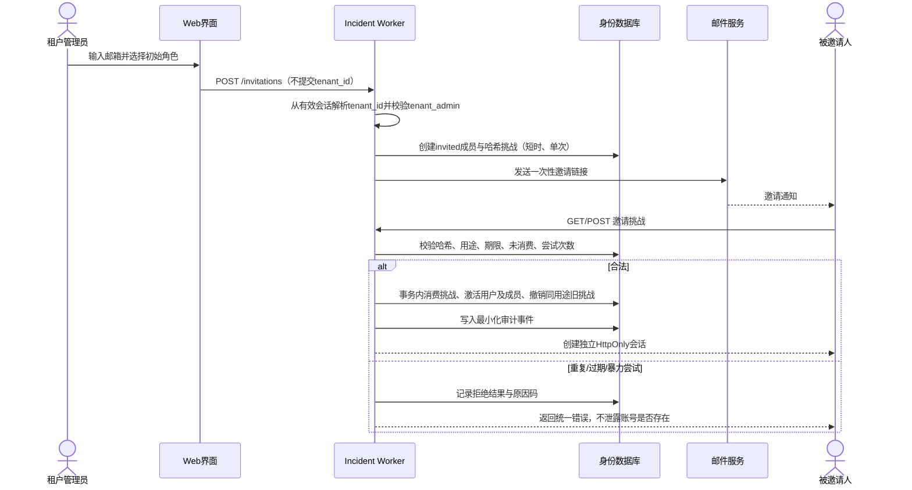
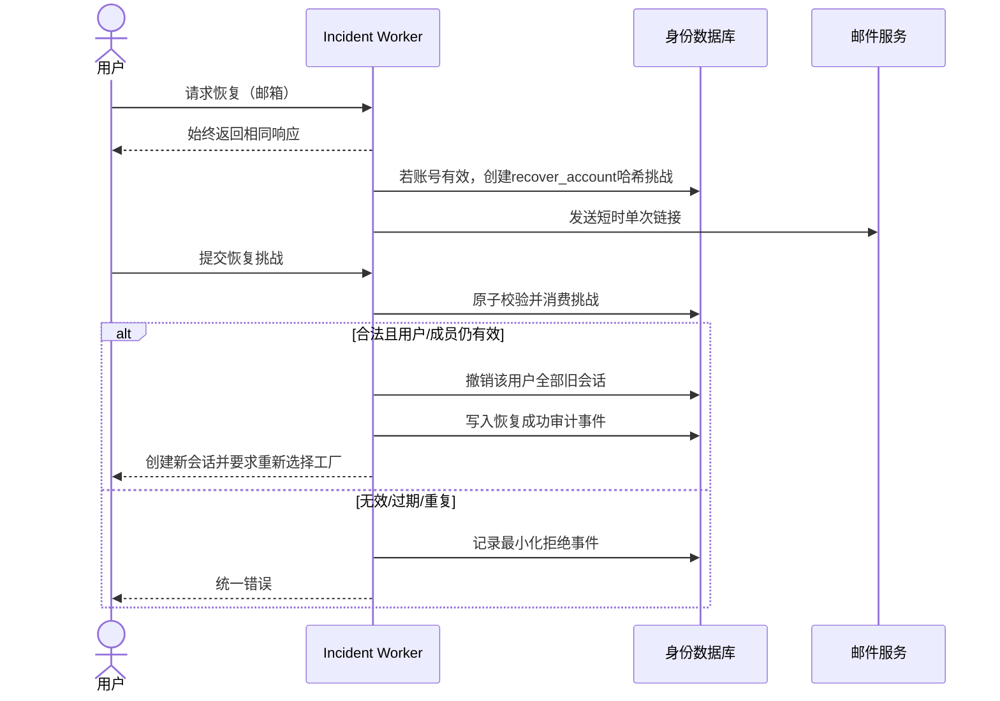

# 事故与事件 / LFI：阶段1.5产品与安全闸门

版本：V0.2

日期：2026-08-12

状态：设计与测试基线，等待产品负责人确认；不得进入阶段2A编码

## 0. 闸门结论与范围

阶段1.5是对第1周技术基线的安全收敛，不是完整LFI业务功能开发。

本阶段只允许：

- 使用虚构标识完善Schema契约、RBAC、审计白名单和负面测试；
- 输出认证、租户解析、数据分级、威胁模型与数据生命周期设计；
- 在公开介绍页说明“阶段1.5、单工厂试点、不收集真实数据”；
- 验证现有页面锚点、静态链接和全站回归。

本阶段禁止：

- 创建或迁移生产D1/R2；
- 开放事故填报、附件上传、导出或真实登录；
- 使用真实企业、姓名、联系方式、事故、伤害或健康数据；
- 修改首页及JSA、会员、法规业务逻辑；
- 将本文件视为法律意见、数据出境批准或阶段2A上线批准。

## 1. 租户边界：试点期一个租户等于一个工厂

试点期固定采用`single_site_pilot`：

> 一个tenant（租户）只代表一个site（工厂/独立运营场所）。

禁止在同一租户下放入多个工厂后仅靠`site_id`过滤。企业如试点多个工厂，必须创建多个租户。集团跨工厂汇总、集团管理员和跨租户LFI共享均不属于阶段2A。

界面必须显示当前工厂名称；API不接受客户端自由切换工厂。未来若扩展为“一企业多工厂”，须重新进行数据模型、授权和迁移评审。

## 2. 企业邀请与账号恢复时序

### 2.1 企业邀请

要求：

- `tenant_memberships.status`默认`invited`，不得默认激活；
- 挑战明文只通过邮件发送，数据库只保存哈希；
- 挑战必须限制用途、有效期、尝试次数和单次消费；
- 激活与消费必须在同一事务中完成；
- 不在URL、日志或分析平台记录挑战明文；
- 邀请者只能授予自己有权管理的租户角色。

### 2.2 账号恢复

恢复不得自动启用`disabled`用户或成员；恢复成功必须撤销全部旧会话。

## 3. 服务端tenant_id解析规则

1. 用户会话Cookie只包含随机令牌；服务端哈希后查询`user_sessions`。
2. 会话必须未过期、未撤销，且`users.status = active`。
3. `active_tenant_id`必须对应状态为`active`的`tenant_memberships`。
4. 每个业务请求的`tenant_id`只取自上述服务端会话上下文。
5. URL参数、查询参数、请求体、表单、请求头中的`tenant_id`均不作为授权依据；若出现且与会话不一致，拒绝并审计。
6. 资源查询固定包含`WHERE tenant_id = :session_tenant AND id = :resource_id`，禁止先按ID查出再在应用层比较。
7. 资源不存在与跨租户资源统一返回404或策略化无信息响应，避免枚举。
8. 搜索、计数、自动完成、导出和附件签名同样执行租户限定，不能只保护详情接口。
9. 切换工厂须调用专用接口，重新验证成员状态后更新会话；客户端不能直接修改会话租户。
10. `platform_admin`不产生`active_tenant_id`，默认不能调用租户业务API。
11. 临时支持访问必须存在未过期、未撤销、由租户侧批准的`platform_support_grants`，并单独审计；阶段2A默认不实现该能力。
12. 数据库复合外键阻止跨租户资源和人员关联，但不能替代API授权。

## 4. RBAC模型与完整权限矩阵

### 4.1 模型

- 用户可在一个租户拥有多个显式角色，存入`tenant_membership_roles`。
- 不使用隐式角色继承；有效权限是所有显式角色权限的并集，再叠加资源所有权、字段级限制、事件状态和职责分离约束。
- `corrective_action_owner`是资源范围，不是租户角色。仅当`actor.user_id = corrective_actions.owner_user_id`时成立。
- `tenant_admin`管理成员和租户配置，默认不能读取事故、调查、健康、导出和审计内容。
- `platform_admin`属于平台运维平面，默认不得读取任何租户业务数据。
- 所有未明确允许的动作默认拒绝。

### 4.2 权限矩阵

图例：`✓`允许；`限`仅本人/获分配资源；`—`默认拒绝；`建议`可提出但不能最终确认。

| 能力 | reporter | investigator | ehs_manager | site_leader | tenant_admin | action owner | platform_admin |
|---|---:|---:|---:|---:|---:|---:|---:|
| 创建快速报告 | ✓ | ✓ | ✓ | ✓ | — | — | — |
| 查看本人报告 | 限 | ✓* | ✓ | ✓ | — | — | — |
| 查看获分配事件 | — | 限 | ✓ | ✓ | — | — | — |
| 查看租户普通事件 | — | — | ✓ | ✓ | — | — | — |
| 修改本人草稿 | 限 | — | ✓ | ✓ | — | — | — |
| 初步分级 | — | 建议 | ✓ | ✓ | — | — | — |
| 调查及证据管理 | — | 限 | ✓ | ✓ | — | — | — |
| 查看人员身份/健康数据 | — | 限且需调查授权 | ✓ | ✓ | — | — | — |
| 建议法定报告判断 | — | — | ✓ | ✓ | — | — | — |
| 最终确认法定报告字段 | — | — | 建议 | ✓ | — | — | — |
| 创建/分配整改措施 | — | 限 | ✓ | ✓ | — | — | — |
| 更新本人整改措施 | — | — | ✓ | ✓ | — | 限 | — |
| 验证整改有效性 | — | — | ✓ | ✓ | — | — | — |
| 编辑LFI通报 | — | 限 | ✓ | ✓ | — | — | — |
| 批准/发布LFI | — | — | — | ✓ | — | — | — |
| 关闭事件 | — | — | 建议 | ✓ | — | — | — |
| 租户数据导出 | — | — | ✓ | ✓ | — | — | — |
| 查看租户审计日志 | — | — | ✓ | ✓ | — | — | — |
| 邀请/禁用成员 | — | — | — | — | ✓ | — | — |
| 配置租户/工厂 | — | — | — | — | ✓ | — | — |
| 修改/删除审计日志 | — | — | — | — | — | — | — |
| 平台健康、账单和部署运维 | — | — | — | — | — | — | ✓ |
| 读取租户业务数据 | — | — | — | — | — | — | — |

`✓*`仅指被明确分配的调查事件，不因调查员角色自动看到全租户事件。

## 5. 数据分类分级

| 等级 | 数据示例 | 允许环境 | 主要控制 | 阶段1.5状态 |
|---|---|---|---|---|
| L0 公开 | 产品说明、公开方法文章、空白模板 | GitHub Pages | 完整性检查、发布审批 | 允许 |
| L1 内部 | 虚构测试ID、无业务含义的配置、角色矩阵 | 代码仓库/测试环境 | 不含真实标识；代码评审 | 允许 |
| L2 受限业务 | 事故时间地点、经过、原因、措施、企业/工厂信息 | 经批准的租户后端 | 租户隔离、RBAC、加密、审计、最短保存 | 阶段1.5禁止采集 |
| L3 敏感个人 | 姓名、联系方式、员工编号、人员身份 | 独立受限数据域 | 字段级授权、加密、导出控制、访问复核 | 阶段1.5禁止采集 |
| L4 高敏感 | 伤害、诊断、病史、医疗健康、身份证件、原始证据 | 经法律与安全批准的专用数据域 | 最小化、单独同意/合法基础、强加密、严格审批、DLP | 阶段1.5禁止采集 |
| L4 安全秘密 | 会话令牌、邀请明文、签名密钥、API密钥 | 密钥/会话系统 | 仅哈希或秘密管理、轮换、永不进入审计 | 永不进入业务库/日志 |

事故详情可能与个人、企业秘密或重要数据组合后提高等级，不能仅按单字段判断。

## 6. 威胁模型

| 威胁 | 攻击路径 | 影响 | 控制与验证 |
|---|---|---|---|
| 跨租户IDOR | 枚举事件ID或修改tenant_id | 泄露/篡改其他工厂数据 | 会话解析租户、复合查询、复合外键、XT-001～006 |
| 越权关闭/确认 | reporter或管理员调用高权限接口 | 错误关闭、错误报告判断 | 默认拒绝、状态机、职责分离、XT-007/008 |
| 附件越权 | 复用或猜测签名URL | 泄露照片、报告、健康资料 | 签名前重新授权、短时单次URL、不公开bucket、XT-005 |
| 旧会话复用 | 用户被禁用后继续请求 | 未授权访问 | 每请求校验用户/成员状态、撤销会话、XT-009 |
| 邀请接管 | 重放、过期、暴力猜测 | 账号/租户入侵 | 哈希、短时、单次、限速、统一响应、XT-010～012 |
| 搜索/导出旁路 | 详情受保护但列表/导出未过滤 | 批量泄露 | 共用授权查询构造器、异步任务绑定租户、XT-002/013 |
| 审计泄密 | before/after保存完整事故 | 二次敏感数据仓库 | 白名单字段、禁止正文、不可变触发器、XT-014/015 |
| 审计销毁 | 管理员更新/删除日志 | 掩盖越权或篡改 | 数据库触发器、独立备份、告警 |
| 平台运维窥探 | platform_admin直接查租户库 | 大范围内部威胁 | 运维/业务平面分离、默认无权、break-glass、XT-016 |
| 恶意附件 | 上传脚本、恶意文件或超大文件 | 终端感染、成本攻击 | 类型/大小白名单、隔离扫描、下载响应头；阶段1.5禁上传 |
| 日志/分析外泄 | URL、错误或埋点含业务内容 | 第三方获得事故/个人信息 | 固定枚举事件、不记录请求体、日志脱敏测试 |
| 备份扩大暴露 | 备份长期保留或恢复到错误租户 | 持续泄露 | 加密、访问隔离、恢复演练、到期删除证明 |
| 数据出境 | D1/R2位置不在中国境内 | 合规及个人权益风险 | 阶段2A前确定部署与法律路径，不创建生产库 |

## 7. 跨租户负面测试清单

结构化用例见`tests/fixtures/incident-cross-tenant-negative-cases.json`，全部使用虚构标识。

| 用例 | 必测场景 | 预期 |
|---|---|---|
| XT-001～004 | A读取、搜索、修改、删除B事件 | 拒绝；搜索不泄露存在性 |
| XT-005 | A获取或使用B附件签名地址 | 不生成签名并拒绝访问 |
| XT-006 | 修改URL/Body/Header中的tenant_id | 忽略客户端租户并拒绝不一致请求 |
| XT-007 | reporter关闭事件 | 403/策略化拒绝并审计 |
| XT-008 | tenant_admin读取健康信息 | 拒绝且不返回字段存在性 |
| XT-009 | disabled用户复用旧会话 | 拒绝并撤销会话 |
| XT-010～012 | 邀请重复、过期、暴力尝试 | 拒绝；限速；统一响应；最小审计 |
| XT-013 | A调用导出接口获取B数据 | 拒绝且不创建导出对象 |
| XT-014～015 | 修改或删除审计日志 | 数据库中止 |
| XT-016 | platform_admin无授权读取租户数据 | 默认拒绝 |

阶段2A必须实现API级集成测试，不能只用Schema字符串测试替代。

## 8. 审计事件白名单

权威机器可读清单：`data/incidents/audit-event-allowlist-v0.2.json`。

每条日志只允许：租户ID、操作者ID、白名单动作、资源类型、资源ID、变更字段名数组、少量枚举型允许值、请求ID、结果、原因码、时间。

禁止保存：完整`before_json/after_json`、事故标题/描述/事实/结论、措施正文、LFI正文、姓名、健康信息、附件名/内容、邮箱、激活码、邀请明文、会话令牌和请求体。

允许值仅限状态、实际/潜在后果等级、调查等级、保密级别、法定报告提醒状态、角色和成员状态等枚举；自由文本只记录“字段发生变化”，不记录值。

白名单外事件和字段必须被审计写入层拒绝。拒绝访问本身也记录结果与原因码，但不得记录攻击者提交的敏感载荷。

## 9. 保存、导出、删除和备份策略

以下为阶段2A前必须由产品负责人、试点企业和法律/安全人员确认的默认草案：

### 保存

- 目的限定与最短必要；每类数据设置可配置期限，禁止“永久保存”默认值。
- 建议起点：邀请挑战24小时内；普通会话最长8小时且支持即时撤销；安全限速记录30天；导出临时文件24小时；附件与事故记录随企业批准的记录计划。
- 法定保存要求与企业档案要求未核实时，不擅自给事故记录设定最终年限。
- 到期任务必须可证明执行，并保留不含正文的删除证明。

### 导出

- 仅`ehs_manager/site_leader`，每次重新校验租户和权限；导出任务绑定`tenant_id + requester_id`。
- 默认排除L3/L4字段；敏感导出需单独审批、目的、字段清单、水印和短时下载。
- 导出文件放入私有存储，禁止公开URL和CDN缓存；下载后或24小时到期删除。
- 每次请求、完成、拒绝和下载均写最小审计事件。

### 删除

- 业务删除优先软删除并受记录保存策略约束；普通管理员不得物理删除审计和批准记录。
- 个人信息请求、合同终止、法定留存冲突和诉讼保全需要明确工作流。
- 租户终止时先冻结导出，完成授权交付，再按批准期限删除主数据、附件、派生文件和可识别备份。

### 备份

- 备份加密、与生产权限分离、最少人员访问；不得复制到个人电脑或公开仓库。
- 定期恢复演练必须用虚构数据；恢复后验证租户隔离和审计不可变性。
- 备份保留期不得超过业务保存政策；到期后应有删除/不可恢复证明。
- D1 Time Travel或供应商备份能力不能替代企业自己的恢复点、恢复时间和删除责任定义。

## 10. D1/R2位置与个人信息出境风险

截至2026-08-12的官方资料显示：

- D1默认根据创建请求选择邻近位置；`apac`仅是位置提示，不保证具体国家/地区。
- D1可强制的公开jurisdiction为`eu`和`fedramp`；创建后不能变更。
- R2自动位置和`apac`同样不能证明中国境内存储；公开jurisdiction为`eu`和`fedramp`，创建后不能变更。
- Workers仍可能从全球位置访问受jurisdiction约束的数据；存储位置和请求处理位置是两个不同问题。

因此，Cloudflare D1/R2方案不能被当前设计直接认定为“中国境内存储”。若中国境内用户的事故、身份或健康信息写入这些服务，可能构成或涉及个人信息向境外提供；敏感个人信息门槛和义务不能仅凭人数低就忽略。

《个人信息保护法》要求个人信息出境满足法定路径之一，并履行告知、单独同意、影响评估等适用义务；2024年《促进和规范数据跨境流动规定》调整了安全评估、标准合同和认证门槛，但不等于免除个人信息保护义务。

阶段2A前必须二选一并书面批准：

1. 选择能够证明中国境内存储与处理的后端/对象存储，并完成供应商、合同、备份和访问审查；或
2. 明确采用境外Cloudflare方案，完成数据地图、接收方、处理目的、字段最小化、敏感信息范围、个人信息保护影响评估、告知/同意及适用出境机制的专业法律审查。

在决定前：不得创建生产D1/R2，不得上传真实附件，不得采集姓名或医疗健康信息。

参考资料：

- Cloudflare D1 Data location：`https://developers.cloudflare.com/d1/configuration/data-location/`
- Cloudflare R2 Data location：`https://developers.cloudflare.com/r2/reference/data-location/`
- 《中华人民共和国个人信息保护法》：`https://www.npc.gov.cn/`
- 国家网信办《促进和规范数据跨境流动规定》：`https://www.cac.gov.cn/2024-03/22/c_1712776612187994.htm`

本文是产品安全判断，不是法律意见。

## 11. 阶段2A验收标准

只有以下条件全部满足并经产品负责人明确确认，才能开始阶段2A编码：

1. 产品负责人确认试点期“一租户=一工厂”。
2. RBAC V0.2确认：多角色无隐式继承、action owner资源范围、tenant/platform admin默认限制。
3. tenant_id只由服务端会话解析的规则通过架构评审。
4. 审计白名单确认，Schema中不存在完整before/after载荷。
5. 数据分类分级及L2～L4字段清单确认。
6. D1/R2或替代方案的数据位置和个人信息出境路径获得书面决定。
7. 保存、导出、删除、备份期限与责任人确认。
8. 邀请/恢复的有效期、限速、会话期限和邮件服务确认。
9. 16个跨租户/越权负面用例转为API集成测试并全部通过。
10. 附件签名、短时有效、无缓存、恶意文件处理方案通过评审；阶段2A若不做附件可明确排除。
11. 不使用真实企业、人员、事故、附件或健康数据，测试数据生成器通过泄漏扫描。
12. 无表单、无生产数据库、无生产API仍是阶段1.5完成状态。
13. 首页、JSA、会员和法规功能回归通过。
14. 已知风险、回滚和事件响应联系人写入发布记录。
15. 产品负责人明确回复批准“开始阶段2A编码”；阶段1.5文档上线不等于该批准。

## 12. 阶段1.5完成定义

- Schema基线完成指定五项修订；
- 10类/16个负面测试场景形成机器可读清单；
- RBAC和审计白名单可机器校验；
- 公开页明确单工厂试点与不采集真实数据；
- 锚点目标真实存在且自动测试验证；
- 全站自动测试、静态链接和Schema语法测试通过；
- 仅提交设计与测试，不创建任何Cloudflare资源。
